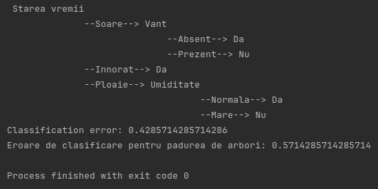

# ML
Some hands-on assignments and projects for my Machine Learning course at my university.

## Lab 1: Data Clustering using K-means
### Introduction
In this laboratory session, we explore the fundamentals of data clustering using the K-means algorithm. K-means is a simple yet effective clustering algorithm that partitions a dataset into K distinct non-overlapping groups (clusters). The objective is to create homogeneous groups where data points within the same group are as similar as possible, while maximizing dissimilarity between different groups.

### Implementation
#### Algorithm Implementation: 
Implement the K-means algorithm for a set of points in the plane and visualize the clustering results. You can utilize the provided source code accompanying the lab documentation. Test the implementation using points from the files knnpoints3.txt, knnpoints4.txt, and knnpoints_uniform.txt.

#### Determining Optimal K: 
Determine the optimal value of K, which yields compact and well-separated clusters, using the silhouette coefficient method. The silhouette coefficient (SC) measures the quality of clustering. It is calculated based on the average distance between points within clusters (a), and the minimum average distance between a point and points in other clusters (b). The silhouette coefficient for a point is given by s(i) = (b(i) – a(i)) / max(a(i), b(i)). The best value of K is the one that maximizes the average silhouette coefficient.

## Lab 2: Data Classification with K-Nearest Neighbors
### Introduction
Data classification involves assigning elements to categories based on their features or attributes. K-Nearest Neighbors (KNN) is a popular classification algorithm that determines the class membership of a new element by considering the classes of its k nearest known neighbors. This lab explores both the basic KNN algorithm and its variant with weighted neighbors.

### K-Nearest Neighbors Algorithm
The KNN algorithm classifies data by considering the classes of its nearest neighbors. We implement both the basic KNN algorithm and its weighted variant, where the contribution of each neighbor to the classification is weighted based on its distance from the new point.

### Testing and Validation
To evaluate the performance of the classifier, we test it on a separate set of data not used during training. Testing involves measuring the classification error, which is the percentage of points misclassified by the algorithm. Additionally, we perform validation to determine the optimal value of k, the number of nearest neighbors to consider, using both simple validation and cross-validation techniques.

### Requirements
Algorithm Implementation: Implement the basic KNN algorithm and its weighted variant. Apply KNN to new points and visualize the classification results.

Error Calculation: Calculate the classification error of the KNN algorithm for the original dataset (without additional points) using a specific value of k (e.g., k=3). Split the data into 60% for training and 40% for testing.

Validation: Conduct validation to identify the best value of k. Split the data into training, validation, and test sets. Perform simple validation by evaluating the classification error for different values of k and selecting the one with the lowest error. Additionally, conduct cross-validation by partitioning the data into multiple subsets and averaging the errors across different values of k.

## Lab 3: Naive Bayes Classifier
### Introduction
In this lab, I implemented a Naive Bayes classifier using Laplace correction for both categorical values and values from a continuous interval. The Naive Bayes classifier is based on the theorem developed by Thomas Bayes and aims to determine the probabilities of classifying a new instance into K classes based on the analysis of the features of instances with known classes.\

### Implementation
I implemented the Naive Bayes classifier using the dataset provided in data_vreme1.csv. The dataset includes instances related to the decision of whether or not to play a certain sport given weather conditions such as weather state, temperature, humidity, and wind. The classifier allows classification of user-specified instances and displays the probabilities of both classes, highlighting the class with the maximum probability.

### Laplace Correction
I incorporated Laplace correction to handle cases where some terms in the probability calculations become null. Laplace correction helps prevent zero probabilities by adding a small value to each count.
Additional Notes

### Additional Info
For the second dataset, data_vreme2.csv, the temperature attribute contains numerical values. Therefore, a different approach is required for calculating probabilities, specifically for mean and standard deviation calculation. We utilized the probability density function of the normal distribution to determine probabilities based on temperature values for each class.

## Lab 4: Decision Trees with ID3 Algorithm
### Introduction
Decision trees are hierarchical classification methods that organize attributes of data from a specific domain, with possible decisions (classes) at the bottom of the hierarchy. ID3 (Iterative Dichotomizer) decision trees order the attributes hierarchically based on the informational gain they provide for making decisions.

### Implementation
#### Algorithm Implementation:
The ID3 algorithm generates decision trees by recursively selecting the attribute that maximizes the informational gain. This lab focuses on implementing the ID3 algorithm to build decision trees for classification tasks.

#### Structure of the Decision Tree:
- The root and intermediate nodes contain attributes, ordered by their decision-making importance.
- Edges represent attribute values (or groups of values).
- Each node has a number of descendants equal to the possible decisions starting from that node.

#### Classification using Decision Trees:
- Generate the decision tree from a training dataset. This dataset contains instances with known classes.
- Traverse the tree for a new instance. This traversal involves repeatedly dividing the possible solutions based on attribute values of the instances until reaching a leaf node containing the class value assigned to the instance.

#### Determining Classification Error:
Calculate the classification error of the decision tree for a set of instances by comparing predicted classes with actual classes.

### Additional Notes
For decision tree generation, the importance order of attributes needs to be established (which attribute is the most important for making the first decision?). To determine the importance, the informational gain (IG) for each attribute is calculated. For the complete tree and any of its subtrees, the root node will contain the attribute that provides the highest IG.

In the case of ID3 trees, IG is determined as the measure by which the entropy of the training data set is reduced following its division based on attribute values.

### Requirements
1. Generate a decision tree using the ID3 algorithm from the dataset provided in data_vreme3.csv. 
2. Use the decision tree to classify instances from the data_vreme4.csv file.
3. Determine the classification error rate of the decision tree for these instances.

## Lab 5: Random Forest Classification
### Introduction
Random Forest is an ensemble learning method used for classification, regression, and other tasks. It operates by constructing a multitude of decision trees at training time and outputs the class that is the mode of the classes (classification) or mean prediction (regression) of the individual trees.

### Implementation
#### Algorithm Implementation:
The Random Forest algorithm involves building multiple decision trees from randomly selected subsets of the training data. Each tree in the forest independently predicts the class of the input, and the final decision is made by aggregating the votes or predictions from all the trees.
Building the Forest:
    Generate a number of random subsets of the training data.
    For each subset, randomly select a subset of attributes.
    Build a decision tree using the selected subset of data and attributes.
    Repeat steps 1-3 to create multiple trees forming the random forest.

#### Classification with Random Forest:
To classify new instances using the random forest:
    Input the instance to each tree in the forest.
    Aggregate the predictions from all trees (e.g., by voting) to determine the final class prediction.

#### Error Calculation:
Calculate the classification error of the random forest for a set of test instances by comparing the predicted classes with the actual classes.

