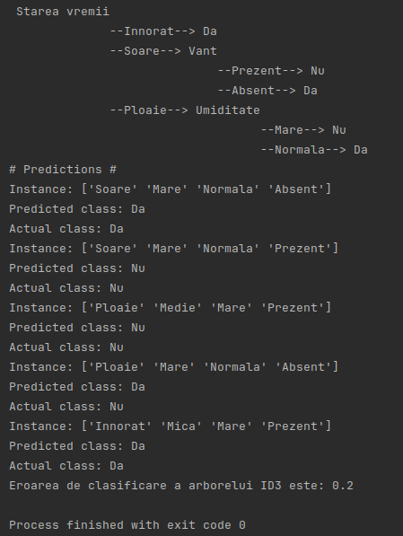
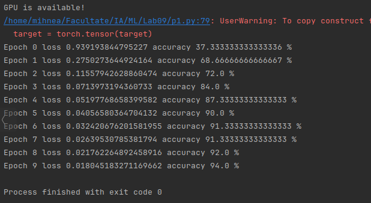

# ML
Some hands-on assignments and projects for my Machine Learning course at my university.

## Lab 1: Data Clustering using K-means
### Introduction
In this laboratory session, we explore the fundamentals of data clustering using the K-means algorithm. K-means is a simple yet effective clustering algorithm that partitions a dataset into K distinct non-overlapping groups (clusters). The objective is to create homogeneous groups where data points within the same group are as similar as possible, while maximizing dissimilarity between different groups.

### Implementation
#### Algorithm Implementation: 
Implement the K-means algorithm for a set of points in the plane and visualize the clustering results. You can utilize the provided source code accompanying the lab documentation. Test the implementation using points from the files knnpoints3.txt, knnpoints4.txt, and knnpoints_uniform.txt.

#### Determining Optimal K: 
Determine the optimal value of K, which yields compact and well-separated clusters, using the silhouette coefficient method. The silhouette coefficient (SC) measures the quality of clustering. It is calculated based on the average distance between points within clusters (a), and the minimum average distance between a point and points in other clusters (b). The silhouette coefficient for a point is given by s(i) = (b(i) – a(i)) / max(a(i), b(i)). The best value of K is the one that maximizes the average silhouette coefficient.

## Lab 2: Data Classification with K-Nearest Neighbors
### Introduction
Data classification involves assigning elements to categories based on their features or attributes. K-Nearest Neighbors (KNN) is a popular classification algorithm that determines the class membership of a new element by considering the classes of its k nearest known neighbors. This lab explores both the basic KNN algorithm and its variant with weighted neighbors.

### K-Nearest Neighbors Algorithm
The KNN algorithm classifies data by considering the classes of its nearest neighbors. We implement both the basic KNN algorithm and its weighted variant, where the contribution of each neighbor to the classification is weighted based on its distance from the new point.

### Testing and Validation
To evaluate the performance of the classifier, we test it on a separate set of data not used during training. Testing involves measuring the classification error, which is the percentage of points misclassified by the algorithm. Additionally, we perform validation to determine the optimal value of k, the number of nearest neighbors to consider, using both simple validation and cross-validation techniques.

### Requirements
Algorithm Implementation: Implement the basic KNN algorithm and its weighted variant. Apply KNN to new points and visualize the classification results.

Error Calculation: Calculate the classification error of the KNN algorithm for the original dataset (without additional points) using a specific value of k (e.g., k=3). Split the data into 60% for training and 40% for testing.

Validation: Conduct validation to identify the best value of k. Split the data into training, validation, and test sets. Perform simple validation by evaluating the classification error for different values of k and selecting the one with the lowest error. Additionally, conduct cross-validation by partitioning the data into multiple subsets and averaging the errors across different values of k.

## Lab 3: Naive Bayes Classifier
### Introduction
In this lab, I implemented a Naive Bayes classifier using Laplace correction for both categorical values and values from a continuous interval. The Naive Bayes classifier is based on the theorem developed by Thomas Bayes and aims to determine the probabilities of classifying a new instance into K classes based on the analysis of the features of instances with known classes.\

### Implementation
I implemented the Naive Bayes classifier using the dataset provided in data_vreme1.csv. The dataset includes instances related to the decision of whether or not to play a certain sport given weather conditions such as weather state, temperature, humidity, and wind. The classifier allows classification of user-specified instances and displays the probabilities of both classes, highlighting the class with the maximum probability.

### Laplace Correction
I incorporated Laplace correction to handle cases where some terms in the probability calculations become null. Laplace correction helps prevent zero probabilities by adding a small value to each count.
Additional Notes

### Additional Info
For the second dataset, data_vreme2.csv, the temperature attribute contains numerical values. Therefore, a different approach is required for calculating probabilities, specifically for mean and standard deviation calculation. We utilized the probability density function of the normal distribution to determine probabilities based on temperature values for each class.

## Lab 4: Decision Trees with ID3 Algorithm
### Introduction
Decision trees are hierarchical classification methods that organize attributes of data from a specific domain, with possible decisions (classes) at the bottom of the hierarchy. ID3 (Iterative Dichotomizer) decision trees order the attributes hierarchically based on the informational gain they provide for making decisions.

### Implementation
#### Algorithm Implementation:
The ID3 algorithm generates decision trees by recursively selecting the attribute that maximizes the informational gain. This lab focuses on implementing the ID3 algorithm to build decision trees for classification tasks.

#### Structure of the Decision Tree:
- The root and intermediate nodes contain attributes, ordered by their decision-making importance.
- Edges represent attribute values (or groups of values).
- Each node has a number of descendants equal to the possible decisions starting from that node.

#### Classification using Decision Trees:
- Generate the decision tree from a training dataset. This dataset contains instances with known classes.
- Traverse the tree for a new instance. This traversal involves repeatedly dividing the possible solutions based on attribute values of the instances until reaching a leaf node containing the class value assigned to the instance.

#### Determining Classification Error:
Calculate the classification error of the decision tree for a set of instances by comparing predicted classes with actual classes.

### Additional Notes
For decision tree generation, the importance order of attributes needs to be established (which attribute is the most important for making the first decision?). To determine the importance, the informational gain (IG) for each attribute is calculated. For the complete tree and any of its subtrees, the root node will contain the attribute that provides the highest IG.

In the case of ID3 trees, IG is determined as the measure by which the entropy of the training data set is reduced following its division based on attribute values.

### Requirements
1. Generate a decision tree using the ID3 algorithm from the dataset provided in data_vreme3.csv. 
2. Use the decision tree to classify instances from the data_vreme4.csv file.
3. Determine the classification error rate of the decision tree for these instances.

## Lab 5: Random Forest Classification
### Introduction
Random Forest is an ensemble learning method used for classification, regression, and other tasks. It operates by constructing a multitude of decision trees at training time and outputs the class that is the mode of the classes (classification) or mean prediction (regression) of the individual trees.

### Implementation
#### Algorithm Implementation:
The Random Forest algorithm involves building multiple decision trees from randomly selected subsets of the training data. Each tree in the forest independently predicts the class of the input, and the final decision is made by aggregating the votes or predictions from all the trees.
Building the Forest:
    Generate a number of random subsets of the training data.
    For each subset, randomly select a subset of attributes.
    Build a decision tree using the selected subset of data and attributes.
    Repeat steps 1-3 to create multiple trees forming the random forest.

#### Classification with Random Forest:
To classify new instances using the random forest:
    Input the instance to each tree in the forest.
    Aggregate the predictions from all trees (e.g., by voting) to determine the final class prediction.

#### Error Calculation:
Calculate the classification error of the random forest for a set of test instances by comparing the predicted classes with the actual classes.

## Lab 6: Gradient Descent Method
### Introduction
The Gradient Descent Method is an iterative algorithm commonly used for approximate optimization problems, especially when minimizing an objective function. Optimization involves finding the best solution to a given problem (optimal solution). The solution is formulated in terms of the values ​​of some parameters of a method/system, aiming to identify the parameter values ​​that lead to optimality. Often, the optimization problem is formulated as a minimization problem of a function that describes unwanted behavior or state of the system under consideration. In such cases, finding the optimal solution means identifying the parameter values ​​that minimize a function describing the error, cost, or losses within that system. The main idea of gradient descent is to gradually adjust the parameter values ​​in the opposite direction of the gradient vector, with the aim of "descending" in the function's domain towards a minimum point.

### Implementation
#### Gradient Descent Algorithm:
Implement the Gradient Descent algorithm to minimize various functions. The lab provides examples of functions along with their analytical derivatives or approximate gradients using finite differences.

#### Visualization:
Visualize the steps of the Gradient Descent algorithm on the graphs of the functions being minimized.

#### Convergence Criteria:
Apply a convergence criteria described in the documentation at each use of the Gradient Descent algorithm.

#### Finding Global Minimum:
For each function, determine the global minimum and graphically represent the steps of Gradient Descent.

#### Multiple Starting Points:
In some cases, finding the global minimum may require applying Gradient Descent from multiple initial points, randomly generated or evenly distributed in the function's domain.

### Tasks
1. **Function:** \( f(x) = x^4 - tx^3 + 14x^2 - 8x \), \( f:[-0.2, 4] \)
   - Use the analytical derivative.

    

2. **Function:** \( f(x) = \frac{{\sin(\sqrt{x})}}{x} \), \( f: [1, 40] \rightarrow \mathbb{R} \)
   - Use the approximate derivative by finite differences.
   
   

3. **Function:** \( f(x, y) = x^4 + 2x^2y -21x^2 + 2xy^2 - 14x + y^4 - 16y^2 - 22y + 170 \), \( f: [-4, 4]^2 \rightarrow \mathbb{R} \)
   - Use the analytical gradient.

   

4. **Function:** \( f(x, y) = (1 - x^2 - y^3) \cdot e^{\left(-\frac{x^2 - y^2}{2}\right)} \)
   - Use the approximate gradient by finite differences.

   

## Lab 7: Linear Regression and Polynomial Regression
### Introduction
Linear regression is a fundamental statistical technique used for modeling the relationship between a dependent variable and one or more independent variables. It assumes a linear relationship between the variables, represented by a straight line in two dimensions. Polynomial regression extends linear regression to model nonlinear relationships by fitting a polynomial equation to the data.

### Linear Regression
Linear regression aims to find the best-fitting straight line through the data points. The line is represented by the equation: y=b0+b1∗xy=b0​+b1​∗x, where b0b0​ is the intercept and b1b1​ is the slope of the line. The coefficients b0b0​ and b1b1​ are determined to minimize the sum of squared differences between the observed and predicted values of the dependent variable.

### Polynomial Regression
Polynomial regression fits a polynomial equation to the data, allowing for curved relationships between the variables. The polynomial equation is of the form: y=b0+b1∗x+b2∗x2+...+bn∗xny=b0​+b1​∗x+b2​∗x2+...+bn​∗xn, where nn is the degree of the polynomial. Higher degrees result in more flexible models that can capture complex patterns in the data.

### Implementation
#### Linear Regression:
    Implement linear regression for the given dataset.
    Calculate the coefficients analytically using the normal equation method.
    Calculate the coefficients using the gradient descent method and compare the results.

#### Polynomial Regression:
    Implement polynomial regression for degrees 2 to 8.
    Determine the mean squared error (MSE) for each polynomial function.
    Identify the polynomial that provides the best fit to the data based on the lowest MSE.

### Tasks
    Linear Regression:
        Determine the coefficients b0b0​ and b1b1​ using both analytical and gradient descent methods.
        Calculate the mean squared error (MSE) for each method.
    Polynomial Regression:
        Implement polynomial regression for degrees 2 to 8.
        Calculate the MSE for each polynomial function.
        Identify the polynomial with the lowest MSE as the best fit for the data.

### Visualization
    Plot the original data points along with the linear regression line obtained analytically.
    Plot the linear regression line obtained using the gradient descent method.
    Plot the polynomial functions of degrees 2 to 8 and highlight the one with the lowest MSE as the best fit.

## Lab 8: Logistic Regression
### Introduction
Logistic regression is a fundamental technique used for binary classification tasks, where the goal is to predict the probability of an instance belonging to a particular class. Unlike linear regression, which predicts continuous values, logistic regression models the probability of the binary outcome using the logistic function (also known as the sigmoid function). The logistic function maps any real-valued number into the range [0, 1], making it suitable for modeling probabilities.

### Logistic Regression Algorithm
The logistic regression algorithm models the probability P(Y=1∣X)P(Y=1∣X), where Y is the binary outcome variable and X is the input feature vector. 
The logistic function σ(z) is defined as: σ(z)=1/(1+e^(−z)), where z is a linear combination of the input features and model coefficients: z=w0+w1x1+w2x2+…+wnxn
Here, w0,w1,…,wn​ are the model coefficients (weights), and x1,x2,…,xn​ are the input features.

### Implementation
#### Algorithm Overview:
Initialize model coefficients w0,w1,…,wnw0​,w1​,…,wn​ with random values.
Compute the linear combination zz for each instance using the current coefficients.
Apply the logistic function σ(z)σ(z) to obtain the predicted probabilities.
Update the coefficients using gradient descent to minimize the cross-entropy loss function.
Repeat steps 2-4 until convergence or for a fixed number of iterations.

### Tasks
Implement logistic regression for binary classification.
Use the cross-entropy loss function as the objective function to be minimized.
Update the model coefficients using gradient descent.
Evaluate the performance of the logistic regression model on a separate test dataset.
Visualize the decision boundary and the probability distribution of the predicted classes.

### Error Calculation
#### Cross-Entropy (Task 1)
To evaluate the performance of the logistic regression model, we calculate the classification error using the cross-entropy loss function. The cross-entropy loss is defined as:

where:
xi is the number of instances, 
yi​ is the true label (0 or 1),  
hat(yi)​ is the predicted probability of the positive class for the i-th instance.

#### Using Mean Squared Error (Task 2)
In addition to cross-entropy loss, logistic regression models can also be evaluated using mean squared error (MSE). MSE measures the average squared difference between the true labels and the predicted probabilities. While cross-entropy loss is more commonly used for logistic regression, MSE can provide insights into the model's performance from a different perspective.

### Results:
#### Using Cross-Entropy for error calculation:

#### Using MSE for error calculation:

## Lab 9: Data Classification using simple neural networks
### Introduction
In this laboratory session, we delve into the classification task using simple neural networks. Neural networks are computational models inspired by the structure and function of biological neural networks. Simple neural networks, also known as feedforward neural networks, consist of an input layer, one or more hidden layers, and an output layer. Each layer contains neurons (or units) interconnected by weighted edges.

### Implementation
#### Algorithm Overview:
1. **Model Architecture**: 
   Define the architecture of a simple neural network with an input layer, one or more hidden layers, and an output layer. The number of neurons in each layer and the activation functions can be customized based on the problem domain.
2. **Forward Pass**: 
   Perform a forward pass to compute the output of the neural network given an input.
3. **Backpropagation**: 
   Use backpropagation to compute the gradients of the loss function with respect to the model parameters (weights and biases). Update the parameters using gradient descent or its variants (e.g., Adam optimizer).
4. **Training**: 
   Train the neural network using labeled training data. Iterate over the dataset multiple times (epochs), adjusting the model parameters to minimize the loss function.
5. **Evaluation**: 
   Evaluate the performance of the trained model on a separate validation or test dataset. Compute metrics such as accuracy, precision, recall, and F1-score to assess classification performance.

### Tasks
1. **Data Preparation**: Load and preprocess the dataset for classification. Split the data into training and testing sets.
2. **Model Definition**: Define the architecture of a simple neural network using PyTorch or a similar deep learning framework.
3. **Training**: Train the neural network using the training dataset. Adjust hyperparameters such as learning rate and the number of epochs.
4. **Evaluation**: Evaluate the trained model on the testing dataset. Compute classification metrics to assess performance.
5. **Hyperparameter Tuning**: Experiment with different hyperparameter settings to optimize the performance of the neural network.

#### Custom Cross Validation:
- **Implementation**: 
  Develop a custom cross-validation function that partitions the dataset into multiple folds (e.g., 5-fold or 10-fold cross-validation). Test the neural network on each fold while holding out the remaining folds for training. Aggregate the evaluation metrics (e.g., accuracy) across all folds to obtain an overall assessment of the model's performance.
- **Benefits**: 
  Custom cross-validation provides a more robust estimate of the model's performance compared to a single train-test split. It reduces the risk of overfitting to a specific training-validation split and provides insights into the variability of the model's performance across different subsets of the data.

### Additional Notes
- Consider techniques such as dropout regularization, batch normalization, and early stopping to improve the generalization and performance of the neural network.
- Visualize the training and validation metrics (e.g., loss curves, accuracy curves) to analyze the training process and identify potential issues (e.g., overfitting).

### Results
- Provide insights into the performance of the trained neural network, including accuracy, precision, recall, and F1-score.
- Analyze the impact of hyperparameters on model performance and suggest potential improvements.

## Lab 10: Convolutional Neural Networks (CNNs) for Image Classification
### Introduction
In this lab, we explore Convolutional Neural Networks (CNNs), a class of deep neural networks well-suited for image classification tasks. CNNs are inspired by the visual cortex's organization in animals and consist of multiple layers of neurons that learn hierarchical representations of image features.

### Implementation
#### Model Architecture
Define a CNN architecture suitable for image classification tasks. A typical CNN architecture consists of convolutional layers, pooling layers, and fully connected layers. Experiment with different architectures, varying the number of layers, filter sizes, and activation functions to optimize performance.

#### Data Preprocessing
Preprocess the image data by resizing them to a standard size, normalizing pixel values, and augmenting the dataset with techniques like rotation, flipping, and scaling to improve model generalization.

#### Training
Train the CNN model on a labeled dataset of images. Utilize techniques such as mini-batch gradient descent, learning rate scheduling, and dropout regularization to optimize training and prevent overfitting.

#### Evaluation
Evaluate the trained CNN model on a separate test dataset to assess its performance. Compute metrics such as accuracy, precision, recall, and F1-score to measure classification performance. Visualize classification results and confusion matrices to gain insights into the model's behavior.

### Tasks
1. **Dataset Selection**: Choose an appropriate dataset for image classification, such as CIFAR-10, MNIST, or a custom dataset relevant to the problem domain.
2. **Model Definition**: Define the architecture of the CNN model using a deep learning framework like TensorFlow or PyTorch.
3. **Data Preprocessing**: Preprocess the image data, including resizing, normalization, and augmentation.
4. **Training**: Train the CNN model on the training dataset, monitoring performance metrics and adjusting hyperparameters as needed.
5. **Evaluation**: Evaluate the trained model on the test dataset, computing classification metrics and visualizing results.
6. **Fine-Tuning**: Experiment with hyperparameters, model architectures, and optimization techniques to improve classification performance.

### Additional Notes
- Experiment with transfer learning by using pre-trained CNN models such as VGG, ResNet, or Inception as feature extractors and fine-tuning them on the target dataset.
- Utilize techniques like data augmentation, dropout regularization, and batch normalization to improve model generalization and robustness.
- Visualize learned features in CNN layers using techniques like activation maximization or feature visualization to gain insights into what the model has learned.

### Results
- Provide insights into the performance of the CNN model, including accuracy, precision, recall, and F1-score on the test dataset.
- Analyze the impact of hyperparameters, model architectures, and optimization techniques on classification performance.
- Visualize classification results, confusion matrices, and learned features to interpret the model's behavior and identify areas for improvement.

